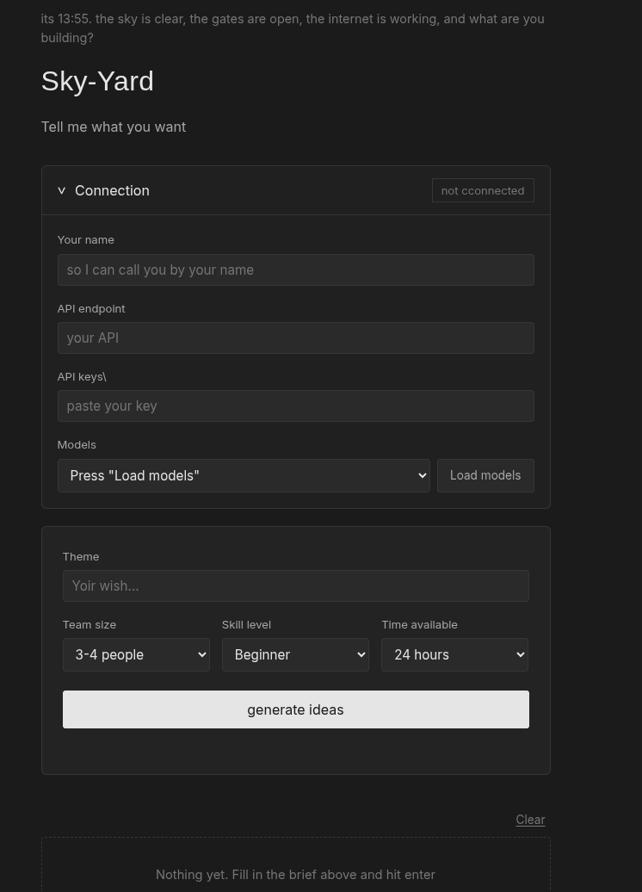

## SkyYard - An idea Generator 

To generate ideas

## Description

SkyYard is an idea Generator, it uses ai to give you ideas... 

## To use 
press 
https://crowcrow611.github.io/Idea-Generator/

### Dependencies

* internet, any OpenAI endpoint ai, a good browser...

### Executing program

* Go to Gemini or groq, similar sites and then get yourself a api key.
* Copy your key, and then go to SkyYard and paste it in the key column
* choose a model
* write your theme, or gist (for multiple themes, please put a "," in between the words)
* press generate

### Screenshot 

